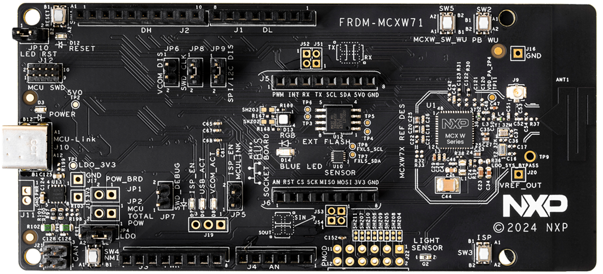
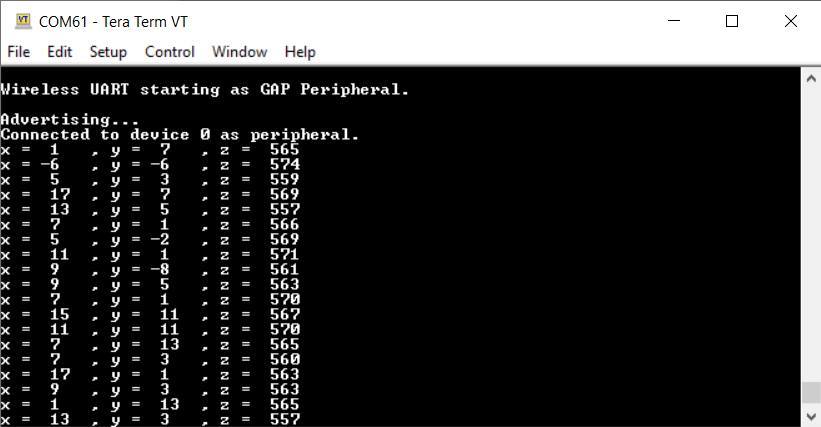
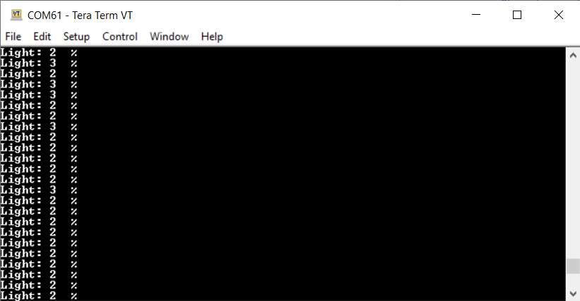

# NXP Application Code Hub


## MCXW71 Accelerometer and light sensor over Wireless UART

This demo serves as guide on enabling FXLS897xxx accelerometer over I2C and light sensor over ADC readings. The ADC conversions are triggered by a hardware timer trigger. The I2C transfers make use of ISSDK. Interact application through the IoT Toolbox using a Smartphone.

The IoT Sensing Software Development Kit (ISSDK) is the embedded software
framework enabling NXP’s digital and analog sensors platforms for industrial and medical IoT applications. ISSDK support models across a broad range of NXP’s Arm® Cortex®-M cores based microcontrollers including NXP’s LPC, Kinetis and i.MX RT crossover platforms. More info at [IoT Sensing Software Development Kit (ISSDK).](https://www.nxp.com/design/design-center/software/sensor-toolbox/iot-sensing-software-development-kit-issdk-embedded-software-framework:IOT-SENSING-SDK)

The boar counts with a FXLS8964AF accelerometer compatible with FXLS89xxxF family driver. This demo modifies “hello world” application.

### Accelerometer Sensor

Following picture shows the high-level layer architecture of the ISSDK v1.8 middleware. ISSDK is designed to provide separable layers of functionality that a customer can choose to use or ignore based on their specific needs. In addition, the ISSDK architecture is portable due to the use of open APIs (ARM Ltd. CMSIS Driver APIs).


[<p align="center">
    
    </p>](images/LightSens.svg "DC Component")

### Light Sensor

The light measured by the sensor may be a time variant signal. In order to get the DC component an average of signal is made. With 600 Hz sampling rate a 100 Hz signal can be extract easylly. Once six samples are taken and averaged a result is ready to be displayed.

[<p align="center">
    
    </p>](images/LightSens.svg "DC Component")

#### Boards: [FRDM-MCXW71](https://www.nxp.com/design/design-center/development-boards-and-designs/general-purpose-mcus/frdm-development-board-for-mcx-w71x-wireless-mcus:FRDM-MCXW71)

#### Categories: Wireless Connectivity, Sensor

#### Peripherals: ADC, I2C, PIT

#### Toolchains: MCUXpresso IDE, VS Code

## Table of Contents

1. [Software](#step1)
2. [Hardware](#step2)
3. [Setup](#step3)
4. [Results](#step4)
5. [FAQs](#step5)
6. [Support](#step6)
7. [Release Notes](#step7)

## 1. Software<a name="step1"></a>

This code has been implemented using MCUXpresso IDE version 11.10.0 and SDK verison 2.16.000.

**Note:**
In order to use any wireless example in the MCXW71 you need to upload the NBU image. This image comes into the SDK version that you will use.

NBU file be found in the following SDK path:

```
"SDK_2_XX_FRDM-MCXW71-> middleware-> wireless-> ble_controller-> bin-> mcxw71_nbu_ble-..-.sb3"
```

You can load NBU image trough [**blhost**](https://www.nxp.com/webapp/sps/download/license.jsp?colCode=blhost_2.6.7&appType=file1&location=null&DOWNLOAD_ID=null). blhost is a command-line debug tool for sending individual commands to
the bootloader.

Once blhost is downloaded the executable can be found in the following paht:

```
blhost_2.6.7.zip\blhost_2.6.7\bin\win
```

Locete NBU file and blhost excutable at in the same direcory and run the following command:

```
 blhost -p COMXX receive-sb-file mcxw71_nbu_ble_1_X_XX_X.sb3 
```

*Replace XX in command by the COMXX number assigned to your board.*

[<p align="center">  </p>](Images/com_port_ex.png)

## 2. Hardware<a name="step2"></a>

- [FRDM-MCXW71](https://www.nxp.com/design/design-center/development-boards-and-designs/general-purpose-mcus/frdm-development-board-for-mcx-w71x-wireless-mcus:FRDM-MCXW71)

[<p align="center">  </p>](https://www.nxp.com/design/design-center/development-boards-and-designs/general-purpose-mcus/frdm-development-board-for-mcx-w71x-wireless-mcus:FRDM-MCXW71)

## 3. Setup<a name="step3"></a>

1. Build project.
2. Connect board to your computer.
3. Upload code to board.
4. Push reset button.

## 4. Results<a name="step4"></a>

When powering the board it starts the advertising role, so you can connect your smartphone using the IoT Toolbox app:

<p align="center">
    
    
</p>


Application will have multiple functionalities; wireless uart and sensors.
Once you connect your phone whit the board you can interact sensors thought the followign commands:

```
SENS A
```

```
SENS L
```


<p align="center">
    
    
    <p align="center">
    
    
    </p>
</p>

You can also change sensor displaying by push SW4.

## 5. FAQs<a name="step5"></a>

No FAQs have been identified for this project.

## 6. Support<a name="step6"></a>

#### Project Metadata

<!----- Boards ----->
[]()

<!----- Categories ----->
[](https://github.com/search?q=org%3Anxp-appcodehub+wireless_connectivity+in%3Areadme&type=Repositories)
[](https://github.com/search?q=org%3Anxp-appcodehub+sensor+in%3Areadme&type=Repositories)

<!----- Peripherals ----->
[](https://github.com/search?q=org%3Anxp-appcodehub+adc+in%3Areadme&type=Repositories)
[](https://github.com/search?q=org%3Anxp-appcodehub+i2c+in%3Areadme&type=Repositories)
[](https://github.com/search?q=org%3Anxp-appcodehub+pwm+in%3Areadme&type=Repositories)

<!----- Toolchains ----->
[](https://github.com/search?q=org%3Anxp-appcodehub+mcux+in%3Areadme&type=Repositories)
[](https://github.com/search?q=org%3Anxp-appcodehub+vscode+in%3Areadme&type=Repositories)

Questions regarding the content/correctness of this example can be entered as Issues within this GitHub repository.

>**Warning**: For more general technical questions regarding NXP Microcontrollers and the difference in expected functionality, enter your questions on the [NXP Community Forum](https://community.nxp.com/)

[](https://www.youtube.com/NXP_Semiconductors)
[](https://www.linkedin.com/company/nxp-semiconductors)
[](https://www.facebook.com/nxpsemi/)
[](https://x.com/NXP)

## 7. Release Notes<a name="step7"></a>

| Version | Description / Update                           | Date                        |
|:-------:|------------------------------------------------|----------------------------:|
| 1.0     | Initial release on Application Code Hub        | August 28<sup>th</sup> 2024 |
